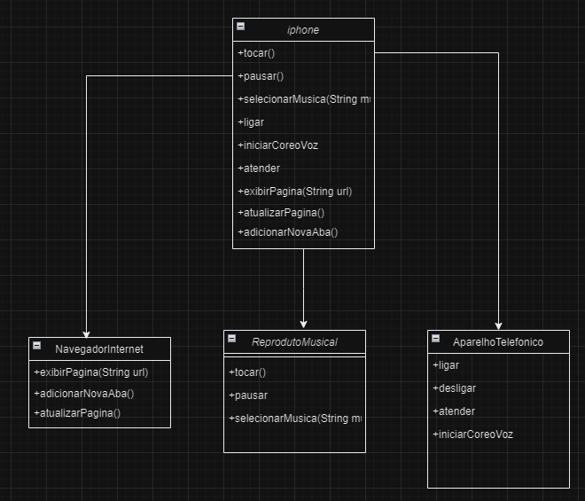

# 📱 Projeto: iPhone - Simulação de Funcionalidades em Java

Este projeto foi desenvolvido para modelar e simular o funcionamento de um **iPhone**, utilizando **Programação Orientada a Objetos (POO)** em Java. O projeto abrange funcionalidades como **Reprodutor Musical**, **Aparelho Telefônico** e **Navegador na Internet**, conforme o desafio proposto.

## 🖼️ Diagrama UML
Abaixo está o diagrama UML que representa a estrutura do projeto:

## 🛠️ Funcionalidades

1. **Reprodutor Musical**
   - `tocar()`: Reproduz a música selecionada.
   - `pausar()`: Pausa a música que está tocando.
   - `selecionarMusica(String musica)`: Seleciona uma música para tocar.

2. **Aparelho Telefônico**
   - `ligar(String numero)`: Faz uma ligação para o número especificado.
   - `atender()`: Atende uma ligação.
   - `desligar()`: desliga.
   - `iniciarCorreioVoz()`: Inicia o correio de voz.

3. **Navegador na Internet**
   - `exibirPagina(String url)`: Exibe uma página web.
   - `adicionarNovaAba()`: Adiciona uma nova aba no navegador.
   - `atualizarPagina()`: Atualiza a página atual.

## 📁 Estrutura do Projeto

